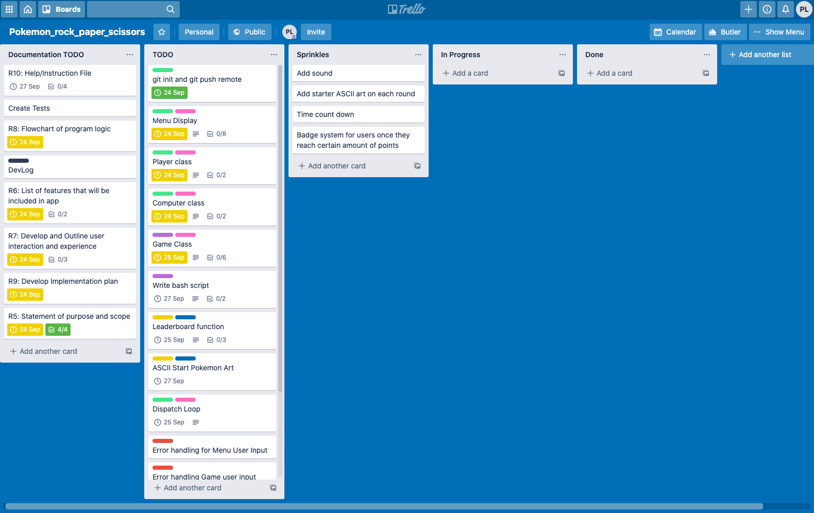
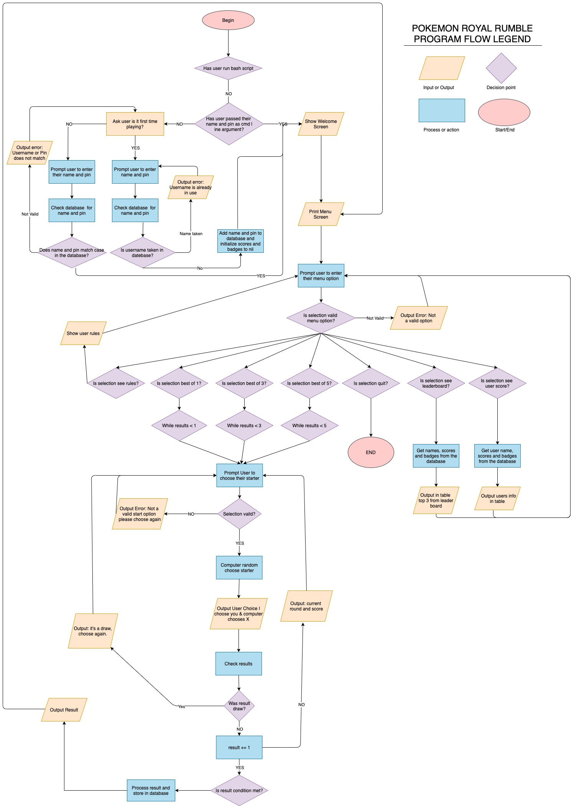

# Software Development Plan

## Statement of Purpose and Scope

#### What will this application do? 
This application will allow users to play a Pokemon themed rock-paper-scissors game against a computer. The game will print the results of each round to the screen and the print the winner in best of 1, 3 and 5 games. It will also allow users to store their all time records and login each time to play on their own personal accounts. 

#### What Problem is this application solving
This application aims to solve the problem of boring rock-paper-scissors games by Pokemon-izing it. I wanted to develop this application to allow users to enjoy rock-paper-scissors in the nostalgic Pokemon universe.

#### Who is the target audience
The target audience for this application is developers looking to have a little fun and compete to be the very best trainer in the pokemon rock-paper-scissors universe.

#### How will the target audience use this application
Developers will use this application anytime they are looking for a quick break. Once they download the application they will be able to access it from the CLI. 

## Features

Water, Grass, Fire will have three key features. 

1. **Menu Screen**: The application features a menu screen which is shown when the user enters the game. The menu will give users several input options; press **'1'** to play best of 1, press **'3'** to play best of 3, press **'5'** to play best of 5, press **'b'** to see the all time leaderboard, press **'s'** to see the users personal stats and records and finally press **'q'** to quit.
    1. The menu will be called within the game loop to print all options to the screen whenever the user is required to make a selection. Errors like invalid inputs are handled by conditional logic.

2. **Leaderboard**: The user can select the option to see the all time leader board for most wins in the game. The leaderboard is displayed in a nicely formatted table ranking the top 3. The stats are stored in a file ***database.json*** and it is updated at the end of each game. The user will immediately then be able to see if they have made it into the top 3 Pokemon Masters. 

3. **The user can input their username and pin as a command line argument as part of the login system**: Post the first time running the program, each additional time the user loads the program they can enter their username and pin as a command line argument. This prevents other users for effecting that players record. If the username and pin are not entered as arguments (checked through conditional logic) the user will be asked if this is their first time playing and to select their username and 4 digit numeric pin. Otherwise they can still enter their existing username and pin once the program has loaded.  

## User Experience and Interaction

#### How the user will find out how to intereact with each feature

Once the user has entered their username and pin, they will be welcomed with a welcome screen, like a start screen in video games (bonus nostalgic sound is featured here). Once they press any key they will be shown a menu of options to pick from. Each menu option is linked to a specific feature.

#### How the user will interact with and use each feature

To interact with the login system once the app is run. They will be prompted to input their information and if the information is not correctly entered they will be informed. 

To get to each additional feature the user will need to interact with the menu feature by inputing a command into the terminal. If a command is invalid the user will be informed the command is invalid and to try again. 

#### How errors will be handled and displayed to the user

The application will utilise conditional loops along with rescues to handle errors. If the user is to enter an invalid username, pin or menu option they will be presented with an error message. The application will loop back to the option prior to the error to again ask for the user input. 

## Implementation plan and design

Before writing a single line of code I planned the application out using the above questions. I then mocked up a flowchart which is below and then created an implementation plan using trello.

As I progressed I would add cards to my trello board to work on. However, the key was having an MVP label, this helped to prioritize what I needed to work on to get a functional app. From there it was all cash money.  

You can see the live trello board [here](https://trello.com/b/8HIVbfY4/pokemonrockpaperscissors).

Screenshots of each day during development are located in the documents folder [here](docs/trello)



## Flow Chart of application 



## Instructions

### Installation Instructions

- Follow these instructions to [download and install](https://www.ruby-lang.org/en/documentation/installation/) Ruby on your local machine.
- Clone or download the project files onto your local machine. 
- Open your computers terminal and run the following command:

```$ install bundler```

- Once bundler has finished installing, enter the following code to install the Gems required to run the application. 

```$ bundle install```

- For the fisrt time use run the application using the following command to launch it(ensure volume is on).

```$ ./run_game.sh```

- In the future you can bypass the login screen by passing your user name and pin as arguments e.g.

```$ run_game.sh username pin```

### Dependencies require for the application to run and how to install them

The following Ruby Gems are require to run the application, however all are included in the Gemfile which will install them if you followed the above instructions. 

* gem "rspec", "~> 3.9"
* gem "json", "~> 2.3"
* gem "text-table", "~> 1.2"
* gem "colorize", "~> 0.8.1"
* gem "ruby2d", "~> 0.9.4"
* gem "pastel", "~> 0.8.0"
*gem "tty-progressbar", "~> 0.17.0"

### System/Hardware requirements

Pokemon Royal Rumble has been tested on MAC OS Catalina Version: 10.15.6.

### How to use the application

* Once you have logged in and have read the welcome screen `PRESS ANY KEY` to enter the main menu.

* In the main menu you are presented with several options to access the option enter the value in `()` e.g. `(1)` will allow you to play a best of one game.
* All available option: 
    * `r` - will show game rules.
    * `1` - will begin a best of one game.
    * `3` - will begin a best of three game.
    * `5` - will begin a best of five game.
    * `b` - will show the user the all time leaderboard of games won.
    * `s` - will show the user their individual round wins/losses and game wins/losses.
    * `q` - will exit the application. 
* In the games users will be asked to choose their starting Pokemon `fire`, `water` or `grass` players must type the starter they wish to use and hit enter. 
* The computer will select their starter at the same time. 
* The round is then played, if their is a winner results will be displayed otherwise if it is a draw the game will be replayed. 
* At the end of the game, the users all time record will be updated. Users then can `PRESS ANY KEY` to return to the main menu. 

## Acknowledgements

Thanks to the creators of the gems, my class mates for pushing my to improve my work and code and to my teachers for helping me to help myself.

I found all my ASCII art and text at the below locations. 

* [Here by Maija Haavisto](https://www.asciiart.eu/video-games/pokemon)
* [ASCII text was generated here](https://patorjk.com/software/taag/#p=display&f=Graffiti&t=Type%20Something%20)

